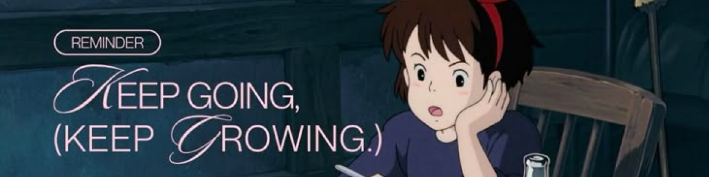

<!-- Imagem de topo -->

  

> _"Você nunca é velho demais para definir outra meta ou para sonhar um novo sonho."_

 

  

**Quem sou?**

Olá, me chamo Mirela Santos e sou apaixonada por programação e tecnologia. Sou estudante do curso de `Informática para a Internet` na `ETEC Cidade Tiradentes`.

Pretendo seguir carreira na área de `Cibersegurança`, buscando entender, proteger e explorar sistemas em um nível mais profundo. Atualmente, estudo fundamentos de segurança da informação e tecnologia por meio da `Solyd` e da `FIAP`, construindo uma base sólida em redes, sistemas e conceitos de segurança.

Estou no início da minha jornada, focada em aprender os fundamentos, praticar de forma consistente e evoluir todos os dias na área de tecnologia.

 

<!-- github status-->
<h3 align="center">
 Github Status 
</h3>
 

<!-- Status -->
<picture>
  <source
    srcset="https://github-readme-stats.vercel.app/api?username=Miih-Santos&show_icons=true&theme=radical"
    media="(prefers-color-scheme: dark)"
  />
  <source
    srcset="https://github-readme-stats.vercel.app/api?username=Miih-Santos&show_icons=true"
    media="(prefers-color-scheme: light), (prefers-color-scheme: no-preference)"
  />
  
</picture>

  
  
<!-- My Tech Stack -->

<h3 align="center"> 𓂃⋆.˚ My Tech Stack ⋆.˚𓂃 </h3>

 

     
     
     
     

 
